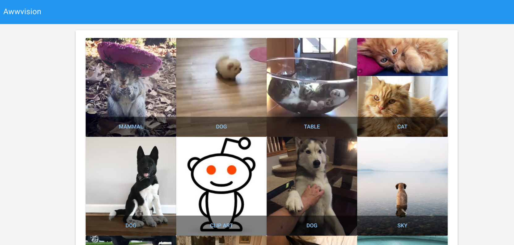

# Exercise: AwwVision

Now that you've [deployed PCF](./quick-deployment.md) and
[logged in to Cloud Foundry](./login-to-pcf.md#cfapi) it's time to explore
the platform and Google Cloud.

This exercise deploys a [spring](https://spring.io/) application that
scrapes [/r/aww](http://reddit.com/r/aww) for photos, stores them in
[Google Cloud Storage](https://cloud.google.com/storage/) and classifies
them with the [Google Cloud Vision API](https://cloud.google.com/vision/).

The services are provisioned by the
[GCP Service Broker](https://docs.pivotal.io/partners/gcp-sb/index.html)
so we will not need to leave Cloud Foundry to create them or setup authentication.

## Deploy AwwVision

### 1. Confirm access to Cloud Foundry

Run `cf apps` to ensure you're connected and authenticated to Cloud Foundry.
If the command fails ensure you've [logged in](./login-to-pcf.md#cfapi).

### 2. Create a org and space for development

Cloud Foundry uses orgs and spaces to contain applications and services.
Create and target an org and space for your development with the following commands:

```bash
cf create-org dev
cf create-space -o dev dev
cf target -o dev -s dev
```

### 3. Ensure Maven/JDK8 is Installed

This sample app requires [maven](https://maven.apache.org/index.html)
and Java 1.8 to build. Users of [Google Cloud Shell](https://cloud.google.com/shell/docs/)
will have this by default.

Confirm with the following commands:
```bash
mvn -version # look for: Apache Maven 3+
java -version # look for: version "1.8"
```

### 3. Build and deploy the application

From the root directory of this project (`gcp-pcf-quickstart`) run the following commands:
```bash
cd docs/samples/awwvision
mvn package -DskipTests && cf push -p target/awwvision-spring-0.0.1-SNAPSHOT.jar --no-start
```

### 4. Create/Bind Google Services

Create a Google Cloud Storage service and bind it to the application.
This provisions a new [storage bucket](https://cloud.google.com/storage/docs/json_api/v1/buckets)
and [service account](https://cloud.google.com/compute/docs/access/service-accounts)
with the role 'storage.objectAdmin'. The bind command will also create
a new [service account key](https://cloud.google.com/iam/docs/creating-managing-service-account-keys)
for your application to authenticate to Google Cloud Storage.

Run the following commands:

```bash
cf create-service google-storage standard awwvision-storage
cf bind-service awwvision awwvision-storage -c '{"role":"storage.objectAdmin"}'
```

To view the credentials, try: `cf env awwvision`

### 5. Start and Aww

The app can now be started and hostname retrieved with the following commands:

```bash
cf start awwvision
cf apps
```

Enter the URL into your browser (eg: http://awwvision-...apps...)
and click on 'Update with latest images'. This may take up to 30 seconds.
Follow the link back to the homepage and view the resulting images:



Click on the text category to view the related images, for example click 'Dog'

## Clean up

Find the name of the Google Cloud Storage bucket by running the following command and looking for "bucket_name":

```bash
cf env awwvision
```

Clear the contents of the bucket:
```bash
gsutil rm gs://<bucket name>/*
```

Delete the binding, service, and app:
```bash
cf unbind-service awwvision awwvision-storage
cf delete-service awwvision-storage
cf delete awwvision
```

## What's Next?
- [Related Resources](../README.md#resources)
- [Delete Deployment](./delete-deployment.md)
